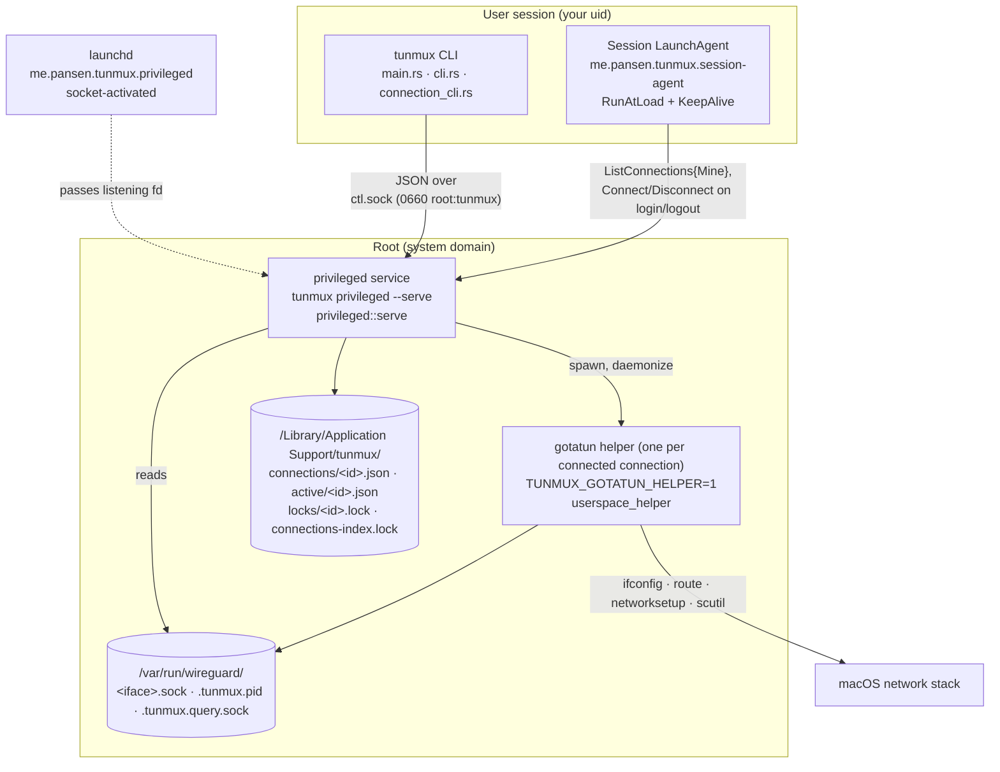
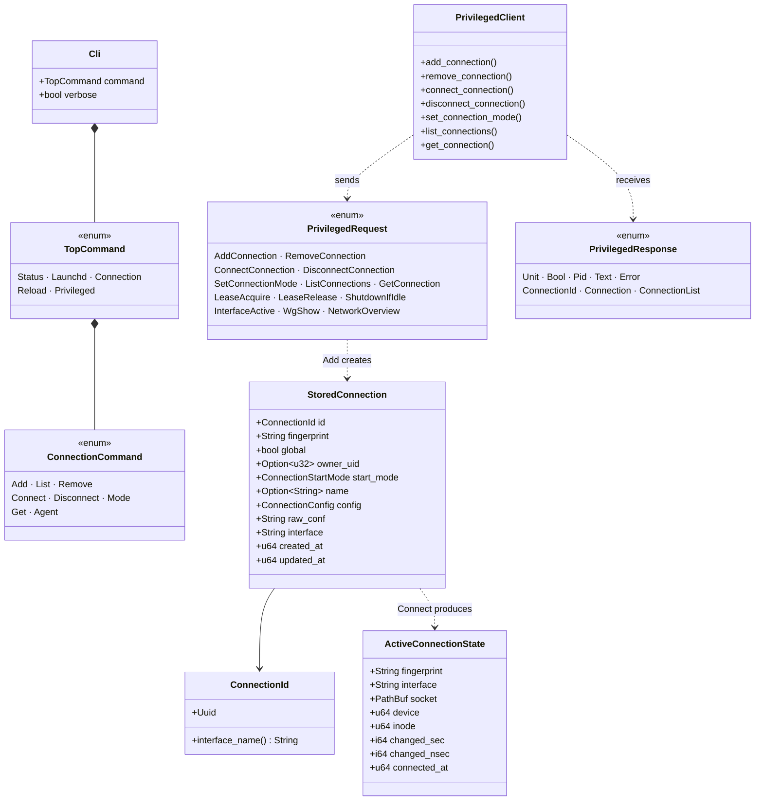
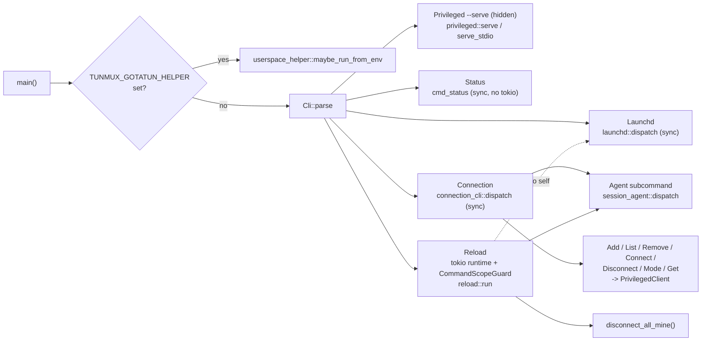
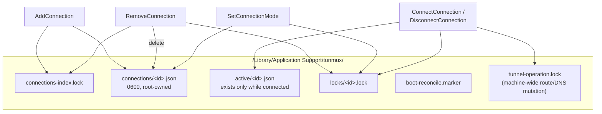
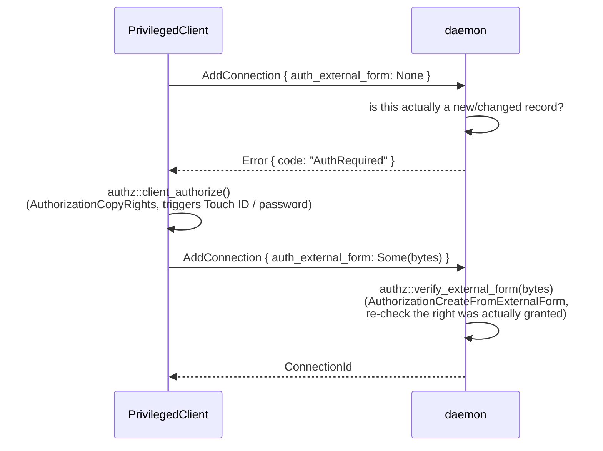
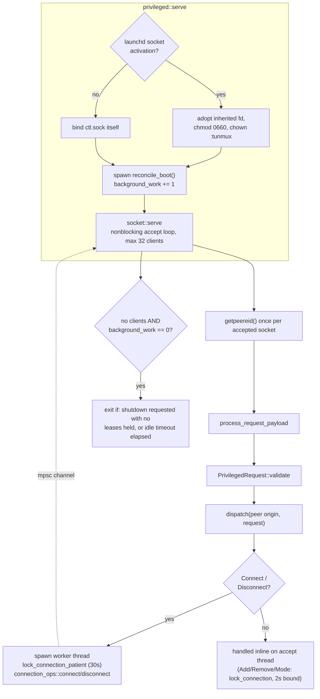
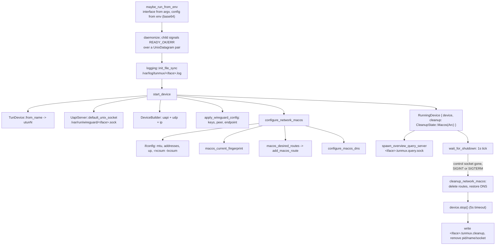
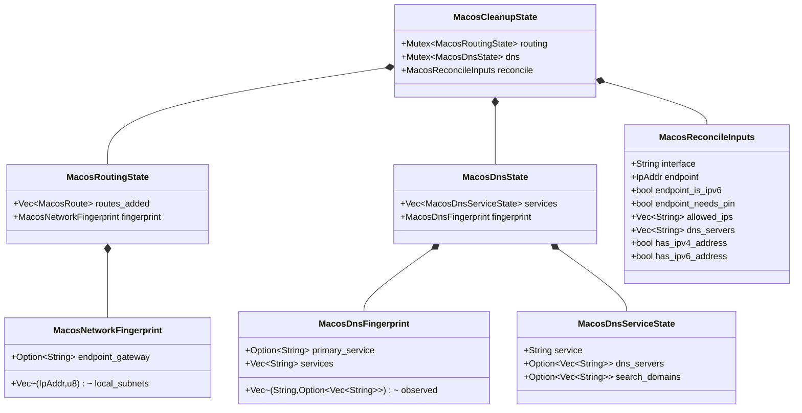
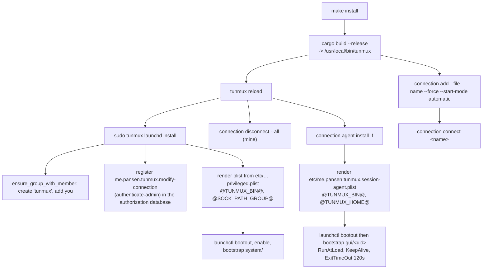

# Architecture: how the pieces fit together

**Scope:** the whole `tunmux` binary, all three roles it runs in.

One binary, three roles. `main()` checks for the helper role first, before
parsing any arguments; everything else, including the privileged service, is
decided by parsing the CLI:

- **helper** if `TUNMUX_GOTATUN_HELPER` is set in the environment
  (`userspace_helper::maybe_run_from_env`, checked before `Cli::parse()`),
- **privileged service** for the `tunmux privileged --serve` subcommand (an
  ordinary, hidden clap subcommand, matched after parsing),
- **user CLI** for everything else.

The user CLI never touches routes, DNS, or the WireGuard control socket. It
sends a JSON request to the privileged service over a Unix socket (or over
stdio when spawned via `sudo -n`), and the service either does the work
itself or spawns a per-connection helper process that owns that tunnel for
its lifetime.

## Processes and the privilege boundary



The boundary is the socket. Everything above it runs as you and is
replaceable; everything below it runs as root and is deliberately small.
`trusted_exec` (`src/trusted_exec.rs`) restricts what root ever executes:
each tool name (`ifconfig`, `route`, `networksetup`, `scutil`, `sh` for
hooks) is mapped to a hardcoded absolute system path rather than searched
for on `PATH`. Root-owned-and-not-a-symlink validation is applied
separately, to the tunmux binary's own install location and to the
root-owned state directories the daemon reads from.

The user CLI holds no state of its own; everything about a connection,
including its private key, lives only in the privileged store.

## The main types



`StoredConnection` is the daemon's on-disk record of a connection: one JSON
file per id under `connections/`, containing the parsed `ConnectionConfig`,
the verbatim `raw_conf` text, and a SHA-256 `fingerprint` over the parsed
struct. `ActiveConnectionState` exists only while a connection is up; it
records the real UAPI socket's device, inode, and change time, which is what
lets the daemon tell a genuinely running tunnel apart from a stale marker
left by a crash or reboot.

Two connections can differ only in `owner_uid`/`global` while everything else
is identical; identity for dedup purposes is `(fingerprint, global,
owner_uid)`, not the id.

## One connect, end to end

This is `tunmux connection connect home`, assuming `home` was already added
as a per-user connection.

```mermaid
sequenceDiagram
    autonumber
    actor U as you
    participant CLI as connection_cli::cmd_connect
    participant PC as PrivilegedClient
    participant SOCK as privileged::socket
    participant DISP as dispatch
    participant CS as connection_store
    participant OPS as connection_ops::connect
    participant HP as gotatun helper (root)
    participant OS as macOS

    U->>CLI: tunmux connection connect home
    CLI->>PC: list_connections(Mine), then Global
    PC->>SOCK: {"kind":"list_connections",...}
    SOCK-->>PC: matching ConnectionSummary
    PC-->>CLI: resolve_id resolves "home" -> ConnectionId

    CLI->>PC: connect_connection(id, debug)
    PC->>SOCK: {"kind":"connect_connection","id":...}
    SOCK->>DISP: dispatch(peer_uid, request)
    DISP->>DISP: authorize_access (owner or root)
    DISP->>DISP: spawn worker thread, return Pending(rx)
    Note over SOCK: accept loop keeps serving<br/>other clients while the worker runs

    DISP->>CS: lock_connection_patient(id), 30s
    CS-->>DISP: ConnectionLock
    DISP->>OPS: connect(&lock, id, debug)
    OPS->>OPS: re-parse raw_conf, verify fingerprint unchanged
    OPS->>OPS: run PreUp hooks (%i -> real interface name)
    OPS->>OPS: lock_system_network_mutation(), 30s
    OPS->>HP: run_gotatun_up: spawn self with<br/>TUNMUX_GOTATUN_HELPER=1, config via env (base64)
    HP->>HP: daemonize, log to /var/log/tunmux/&lt;iface&gt;.log
    HP->>OS: TunDevice + UapiServer + apply_wireguard_config
    HP->>OS: configure_network_macos: addresses, routes, DNS
    HP-->>OPS: parent exits after child signals READY_OK
    OPS->>OPS: run PostUp hooks
    OPS->>CS: save_active(&lock, id, ActiveConnectionState)
    OPS-->>DISP: Ok
    DISP-->>SOCK: result over mpsc channel
    SOCK-->>PC: {"kind":"unit"}
    PC-->>CLI: Ok
    CLI-->>U: "Connected <id>"
```

The parts worth noticing:

`connect()` re-parses the stored `raw_conf` and compares its fingerprint
against the one recorded at add time before doing anything else. A mismatch
(for example after a parser change between versions) refuses with "stored
connection is stale, remove and re-add it" rather than running with drifted
semantics.

`ConnectConnection`/`DisconnectConnection` run on a spawned worker thread, not
on the accept loop itself, so a slow tunnel bring-up cannot freeze other
clients. `Add`/`Remove`/`SetConnectionMode` still run synchronously on the
accept thread, under a 2-second bound, since they are expected to be fast.

Two separate locks are involved: `lock_connection_patient` (30s, per
connection id) guards the `StoredConnection`/`ActiveConnectionState` record
itself, while `lock_system_network_mutation()` (30s, one lock for the whole
daemon) guards the actual `run_gotatun_up`/`run_gotatun_down` calls, since
route and DNS mutation is genuinely machine-wide state. Two different
connections can both hold their own per-id lock at once, but still serialize
on the network-mutation lock around the moment they actually touch routes or
DNS.

## Command dispatch



`Status`, `Launchd`, and `Connection` are synchronous and skip the tokio
runtime entirely, since none of them holds a privileged session open across
an `await`. `Reload` is the one command that needs a runtime: it re-execs
itself under `sudo` for the daemon-install step, calls `PrivilegedClient`
directly to disconnect every one of the caller's connected connections, then
re-renders and re-bootstraps the session agent.

Name-or-id resolution (`resolve_id`, `src/connection_cli.rs`) tries parsing
the argument as a `ConnectionId` first; if that fails, it searches
`ListConnections{Mine}` for a matching `name`, then `ListConnections{Global}`
if nothing owned matches, and errors on zero or on more than one match.

## Connection store and locking



Locking rule, enforced by `IndexLock`/`ConnectionLock` being required
function parameters rather than convention: **index-then-per-id, never the
reverse**. `AddConnection` holds `connections-index.lock` for the full
duration of interface-name allocation and record creation.
`RemoveConnection` takes the index lock, then the target's per-id lock, in
that order, so it can never deadlock against a concurrent connect on the
same id. `ConnectConnection`/`DisconnectConnection`/`SetConnectionMode` only
ever take the per-id lock.

Interface names are derived deterministically from the id
(`wg-<8 hex chars>`), not caller-supplied, and their uniqueness is checked
under the index lock at add time. `tunnel-operation.lock` is the one lock
that is genuinely machine-wide (it guards the previous network state a
reconcile pass captures), so it still serializes `run_gotatun_up`/
`run_gotatun_down` across every connection, even though each connection
otherwise has its own lock.

## Admin authentication

Adding, removing, or elevating a global connection from manual to automatic
each require real macOS admin authentication, not just `tunmux`-group
membership, since those are the only operations that let new
root-executed config content (including `PreUp`/`PostUp`/`PreDown`/
`PostDown` hooks) into the store or make it run unattended at boot.



An identical resubmission (same fingerprint, same `global`) never creates a
new record. If it also carries a different `name` or `start_mode`, those
fields update in place without going through this flow at all, unless the
update is the one exception that still needs it: elevating a global
connection from manual to automatic. `Connect`, `Disconnect`, and every
other `SetConnectionMode` transition (per-user, or downgrading a global
connection back to manual) proceed on ownership alone, the same way the
macOS Network pane asks for admin credentials to add a VPN profile but not
to connect one that's already configured.

The custom right, `me.pansen.tunmux.modify-connection` with rule
`authenticate-admin`, is registered in the system authorization database by
`src/launchd.rs` at `tunmux launchd install` time; without that step the
prompt has nothing to authenticate against. The runtime two-phase check
itself lives in `src/privileged/authz.rs`: `client_authorize()` runs in the
CLI process, `verify_external_form()` runs in the daemon.

## Boot and session reconciliation

Two independent mechanisms bring connections up without a manual `connect`,
matching the two connection kinds:

- Global connections reconcile at daemon start, not at boot: the daemon is
  socket-activated on demand, so "daemon start" happens the first time
  anything touches `ctl.sock` after a reboot. `connection_store::
  reconcile_boot()` runs on a background thread as soon as the socket is
  bound (not before, so N helper-startup handshakes don't delay every other
  client). It reads the current boot id (`sysctl kern.boottime`) and skips
  entirely if a marker file already records that id, so a restart of the
  on-demand daemon within the same boot doesn't undo an admin's explicit
  `disconnect`. Otherwise it connects every stored connection that is
  `global`, `Automatic`, and not already active, logging and continuing past
  any individual failure. The marker is only written when every candidate in
  the pass succeeded, so a merely transient failure (DNS not up yet) is
  retried on the daemon's next wake instead of being stuck down for the rest
  of the boot.
- Per-user connections reconcile for the session's lifetime. The session
  agent (`tunmux connection agent run`, installed as a long-lived, per-user
  LaunchAgent with `RunAtLoad`+`KeepAlive`) blocks `SIGTERM` (`pthread_sigmask`
  via `SigSet::thread_block`) as the very first statement it runs, before
  doing anything else, then calls `ListConnections{Mine}` and connects every
  `Automatic` result. It then waits on the now-queued signal with a real
  `sigwait(3)` call; on delivery (logout, or `launchctl bootout`), it calls
  `ListConnections{Mine}` again and disconnects everything currently
  connected before exiting, so a per-user tunnel never outlives the session
  that started it. Blocking the signal before the initial reconcile matters:
  reinstalling the agent bootstraps a fresh instance immediately, and an
  early `SIGTERM` landing mid-reconcile under the default disposition would
  otherwise kill it with no teardown at all. Fast user switching to a
  different session is not covered: the switched-away session's agent is
  never sent `SIGTERM`, so its tunnels stay up.

Both reconcilers ultimately call the same `connection_ops::connect`/
`disconnect` used by the RPC dispatch arms; the session agent just reaches it
over the socket like any other client, since it runs as your user, not root.

## Inside the privileged service



Peer credentials are captured once per accepted connection via macOS's
`getpeereid()` (there is no `SO_PEERCRED` on macOS), not re-queried per
request, since the uid is invariant for the socket's lifetime. Ownership
rules are uniform across every op that touches a specific connection: a
global record requires the caller be root; a per-user record requires the
caller be its owner or root. The same rule also gates
`WgShow`/`NetworkOverview`/`InterfaceActive` (kept from before the connection
store, for `status`'s interface-detail lookups) whenever the interface name
they were given happens to belong to a stored connection, closing a gap
where any `tunmux`-group member could act on a connection's interface once
its name leaked via `ListConnections{Global}`.

`background_work` is an atomic counter, incremented while boot reconciliation
(or any other background task) is running. Without it, the daemon's
idle-exit check could fire mid-reconciliation with zero clients connected,
killing the daemon right after a helper started but before its
`ActiveConnectionState` was written, leaving a tunnel that is actually up
reported as down until the next reconcile pass.

There is a second transport, `stdio`, selected by config and spawned only via
`sudo -n <exe> privileged --serve --stdio`. Because the caller has already
proven root by the time that session exists, its peer origin is treated as
uid 0 outright; the only open question is which per-user bucket to credit a
`global: false` `AddConnection` to, resolved with a best-effort `$SUDO_UID`
read that is explicitly not a security boundary.

## Inside the helper

One helper process per connected connection. It is spawned by
`connection_ops::connect` (via `commands::run_gotatun_up`), daemonizes, and
then owns that tunnel until its UAPI socket is removed or it is signalled.



Teardown is a handshake, not a kill. `run_gotatun_down` removes the UAPI
socket, which the helper's tick loop reads as a shutdown request, then waits
up to 15 seconds for the helper to write `ok` into its cleanup-status file,
falling back to `SIGTERM` and a further 5 seconds. Only after a confirmed
`ok` does it check that the `utunN` interface is really gone
(`src/privileged/commands.rs`, `run_gotatun_down`). `PreDown`/`PostDown` hooks
around this are best-effort: a broken hook logs and is skipped rather than
stranding the caller with a connection they explicitly asked to remove.

## Continuous reconciliation

This is the part that makes a connected tunnel survive roaming. Every 3
seconds the helper re-snapshots the network and, if anything moved,
re-applies routes and DNS for its own connection.



Both reconcilers follow the same shape: snapshot the environment into a
fingerprint, compare it to the stored one, and act only on a difference. Both
run on `spawn_blocking` via `run_macos_maintenance`, awaited so ticks cannot
overlap and teardown cannot race a worker mid-change, and so shelling out to
`ifconfig`/`scutil`/`networksetup` never stalls the single-threaded runtime
that is also moving packets.

Routes: `macos_desired_routes` is the endpoint pin (only when AllowedIPs
would otherwise capture the endpoint) plus the AllowedIPs routes, minus
anything that falls inside a directly-connected subnet. That subtraction is
what keeps a split tunnel from hijacking the LAN you are actually on.

The subtraction alone is not enough, because a prefix can only hold one
entry. Joining a LAN the tunnel already routes (roaming into a subnet that is
also in AllowedIPs) means the kernel cannot install that interface's
connected route, and the tunnel route it lost out to is removed on the next
reconcile, leaving the LAN with no route at all. Two rules close that gap.
`add_macos_route` checks who holds a prefix before touching it, clearing a
stale entry only when a tunnel device owns it and otherwise leaving the
prefix alone and unowned, and `macos_restore_shadowed_lan_route` re-adds the
connected route, scoped to its device, whenever removing a tunnel route
leaves a local subnet uncovered.

DNS: `plan_dns_actions` is deliberately I/O-free and therefore unit-testable.
It takes the tunnel's DNS, the observed environment, the services currently
owned, and the services that should be owned, and returns what to apply,
restore, or drop. Under the active `PrimaryOnly` policy only the service
owning global resolution gets tunnel DNS. `dns_reconcile_forced` handles the
case a fingerprint cannot see: a DHCP-provided resolver on a LAN that shadows
the tunnel's own DNS server address, where nothing observable changes but
ownership still has to move.

## Status

`tunmux status` (`cmd_status` in `src/main.rs`) is read-only and pulls from
two RPC calls plus, best-effort, per-connection detail.

```mermaid
sequenceDiagram
    participant S as cmd_status
    participant PC as PrivilegedClient
    participant D as privileged
    participant HP as helper

    S->>PC: list_connections(Mine)
    S->>PC: list_connections(Global)
    S->>S: render the summary table<br/>(Id · Name · Global · Mode · Connected · Interface)
    loop per connected connection
        opt caller is root, or connection is per-user
            S->>PC: wg_show(iface)
            PC->>D: WgShow
            D-->>S: text
            S->>PC: network_overview(iface)
            PC->>D: NetworkOverview
            D->>HP: connect &lt;iface&gt;.tunmux.query.sock
            HP-->>D: freshly rendered route/DNS table
            D-->>S: text
        end
    end
```

Detail calls for a **global** connection are only made when the caller is
root; a non-admin user running `status` with a global VPN connected would
otherwise get an `Auth` error printed to stderr for every such connection,
since the daemon correctly denies those legacy calls to non-owners. Both
detail fetches are best-effort regardless: a failure prints to stderr and
never makes `status` fail.

## Installation and lifecycle



`launchd` handles the root daemon in the system domain; `session_agent`
handles the per-user agent in the GUI domain. `reload` refuses to run as
root and escalates only the daemon step, matching `session_agent`'s own
`refuse_if_root` guard. `make install` runs `reload` before `connection add`
so the freshly (re)installed session agent isn't immediately torn down and
rebuilt by a second, redundant install right after bringing the connection
up.

## Where to start reading

| Question | File |
| --- | --- |
| What commands exist and what do they take? | `src/cli.rs` |
| What happens for a connect? | `src/connection_cli.rs`, `src/privileged/connection_ops.rs` |
| What crosses the privilege boundary? | `src/privileged_api.rs` |
| How does the client reach root? | `src/privileged_client/mod.rs` |
| What does root actually run? | `src/privileged/commands.rs`, `src/trusted_exec.rs` |
| How is a connection's identity and store layout defined? | `src/privileged/connection_store.rs` |
| How does admin authentication work? | `src/privileged/authz.rs` |
| How does per-user login/logout reconciliation work? | `src/session_agent.rs` |
| How do routes and DNS stay correct? | `src/userspace_helper.rs` |
